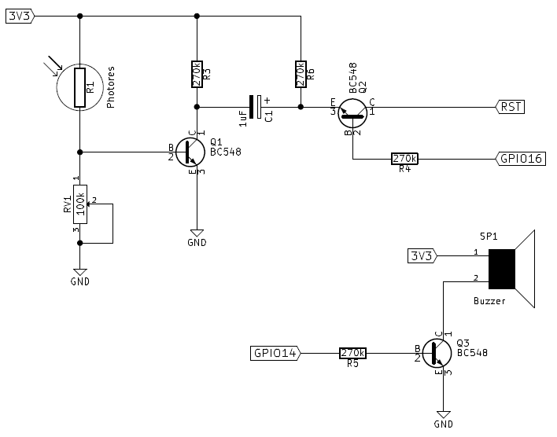

## Objective

Protect my immaculate desk draw contents from invading marauders using
an ESP8266 and IFTTT.

## Schematic

## Converting LDR pulse to reset signal

## Details

Please read the full article here:

http://electronut.in/esp8266-desk-draw-protector/
